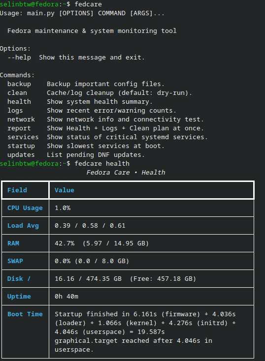
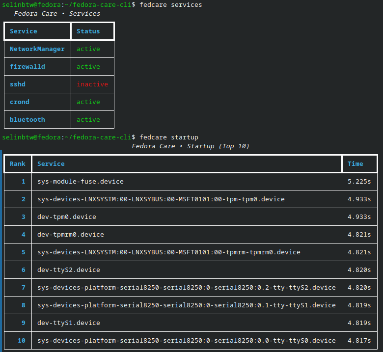
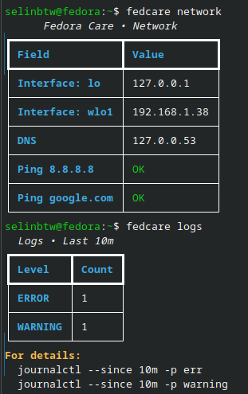
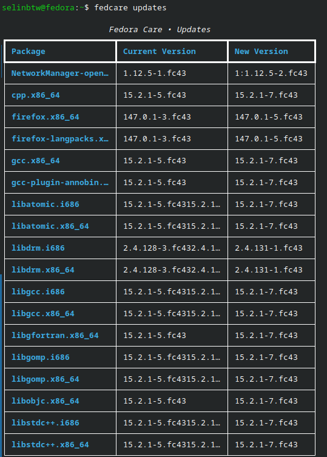
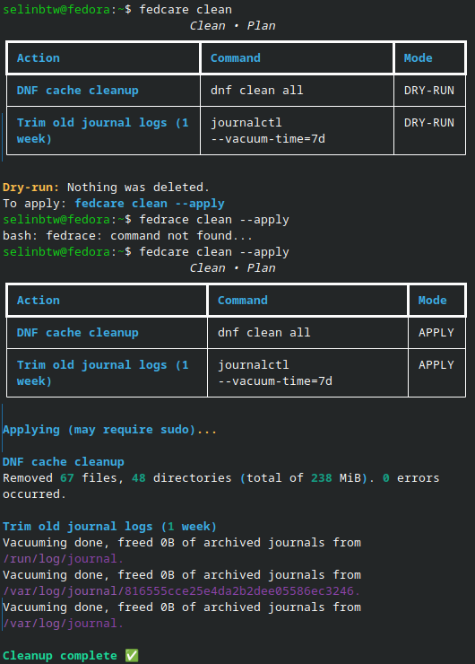
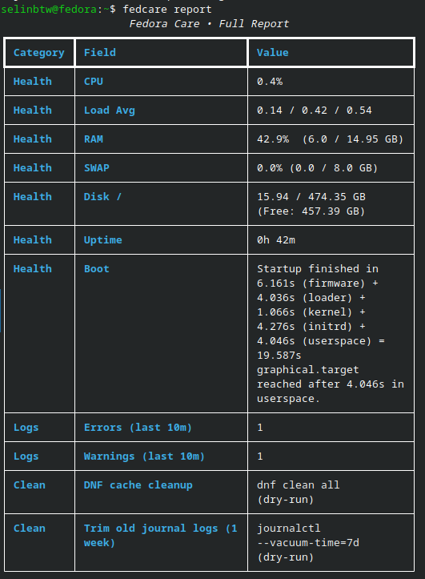

# Fedora Care CLI

A terminal-based maintenance and system monitoring tool for Fedora Linux. Check system health, monitor systemd services, test network connectivity, list pending DNF updates, backup config files, and analyze boot performance — all from a single command.

**Features:** CPU/RAM/disk monitoring, systemd service status, network diagnostics, journalctl log analysis, DNF update checker, config file backup, boot time analysis, full system report. All commands support `--json` output for scripting and automation.

## Installation

### Via DNF (Recommended)

```bash
sudo dnf copr enable selinbtw/fedcare
sudo dnf install fedora-care-cli
```

### Via pip

```bash
pip install -e .
```

## Commands

| Command | Description |
|---------|-------------|
| `fedcare health` | System health summary (CPU, RAM, SWAP, disk, uptime, boot time) |
| `fedcare services` | Status of critical systemd services |
| `fedcare network` | Network interfaces, DNS, and connectivity test |
| `fedcare logs` | Recent error/warning counts from journalctl |
| `fedcare updates` | List pending DNF updates |
| `fedcare clean` | Cache/log cleanup (default: dry-run) |
| `fedcare backup` | Backup important config files |
| `fedcare startup` | Slowest services at boot |
| `fedcare report` | Combined Health + Logs + Clean report |

Every command supports the `--json` flag for JSON output.

## Screenshots

### `fedcare health`


### `fedcare services` & `fedcare startup`


### `fedcare network` & `fedcare logs`


### `fedcare updates`


### `fedcare clean` & `fedcare clean --apply`


### `fedcare report`


## Usage

```bash
fedcare health
fedcare services --json
fedcare backup --dest ~/my-backup
fedcare startup --top 15
fedcare clean --apply
```

## Requirements

- Fedora Linux
- Python 3.10+
